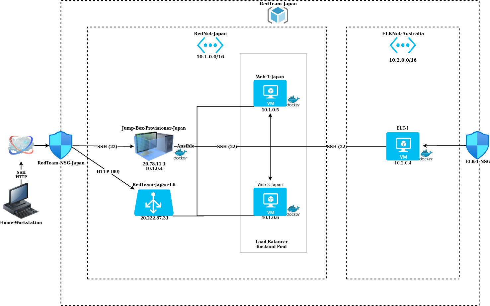
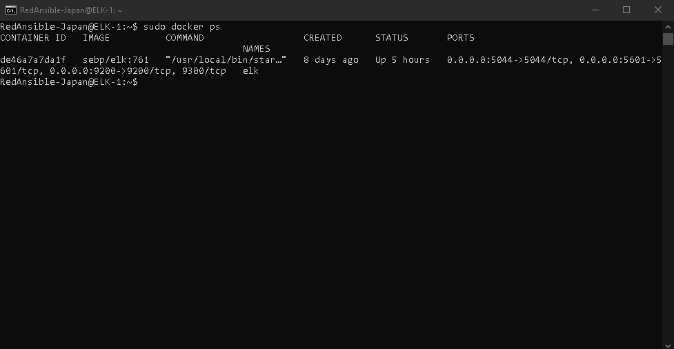

## ELK-Stack-Project1
My first project, to generate a live ELK Stack Deployment.

These files have been tested and used to generate a live ELK deployment on Azure. They can be used to either recreate the entire deployment pictured above. Alternatively, select portions of the **YAML** file may be used to install only certain pieces of it, such as Filebeat.

- [install-elk.yml](Ansible/install-elk.yml)
- [filebeat-config.yml](Ansible/filebeat-config.yml)
- [filebeat-playbook.yml](filebeat-playbook.yml)
- [metricbeat-config.yml](metricbeat-config.yml)
- [metricbeat-playbook.yml](metricbeat-playbook.yml)

This document contains the following details:

- Description of the Topology
- Access Policies
- ELK Configuration
  - Beats in Use
  - Machines Being Monitored
- How to Use the Ansible Build

### Description of the Topology

The main purpose of this network is to expose a load-balanced and monitored instance of DVWA, the D*mn Vulnerable Web Application.

Load balancing ensures that the application will be highly **available**, in addition to restricting **inbound access** to the network.

> *What aspect of security do load balancers protect? What is the advantage of a jump box?*
- The load balancer's main purpose is to distribute web traffic across multiple servers and could potentially protect the server against denial of service (DDoS) attacks.

- Some of the advantages of a jump-box includes limiting ease of access from the public. In order to access the other virtual machines, an individual would need the private IPs of those machines. They also allow greater control over access to a virtual network and its content.

Integrating an ELK server allows users to easily monitor the vulnerable VMs for changes to the **files** and system **metrics**.

> *What does Filebeat watch for?*
- Filebeat helps keep things simple by offering a lightweight way to forward and centralize logs, files and watches for changes.

> *What does Metricbeat record?*
- Metricbeat helps monitor servers by collecting metrics from the system and services running on the server so it records machine metrics and stats, such as uptime.

The configuration details of each machine may be found below.

| Name     | Function | IP Address | Operating System |
| -------- | -------- | ---------- | ---------------- |
| Jump-Box-Provisioner-Japan | Gateway  | 10.1.0.4   | Linux            |
| Web-1-Japan     | Webserver      | 10.1.0.5           | Linux                 |
| Web-2-Japan     | Webserver      | 10.1.0.6           | Linux                 |
| ELK-1     | Kibana         | 10.2.0.4           | Linux                 |

### Access Policies

The machines on the internal network are not exposed to the public Internet. 

Only the **Jump-Box** machine can accept connections from the Internet. Access to this machine is only allowed from my home IP address.

Machines within the network can only be accessed by **SSH**.

A summary of the access policies in place can be found in the table below.

| Name     | Publicly Accessible | Allowed IP Addresses |
| -------- | ------------------- | -------------------- |
| Jump Box | Yes              | *My home IP*   |
| ELK         | Yes (Port 5601)                   | *My home IP*                     |
| Web-1-Japan         | No                    | 10.1.0.1-254                     |
| Web-2-Japan         | No                    | 10.1.0.1-254                     |

### Elk Configuration

Ansible was used to automate configuration of the ELK machine. No configuration was performed manually, which is advantageous because...

> *What is the main advantage of automating configuration with Ansible?*
- It very simple to setup and use. It's flexible and reusable.

The playbook implements the following tasks:

- Install Docker
- Increase virtual memory
- Install PIP-3
- Download and launch a Docker container
- Enabling service on boot

The following screenshot displays the result of running `docker ps` after successfully configuring the ELK instance.

### Target Machines & Beats

This ELK server is configured to monitor the following machines:

- *Web-1-Japan: 10.1.0.5*
- *Web-2-Japan: 10.1.0.6*

We have installed the following Beats on these machines:

- *Filebeat*
- *Metricbeat*

These Beats allow us to collect the following information from each machine:

- Filebeat collects log information about the file system and tells you which files has been tampered with and when the specific event has occured to either Elasticsearch or Logstash. You can view these outputs by connecting to Kibana. For example, you would select the specific Filebeat you're looking for from your dashboard. You can also specify by date and time as well.
- Metricbeat shows the statistics for all the processes running on on your system including memory, CPU usage, file system, Network IO and disk IO statics. To view these data, you would once again, connect to Kibana, select the system you'd like to review and from there you can view the metrics of the system.

### Using the Playbook

In order to use the playbook, you will need to have an Ansible control node already configured. Assuming you have such a control node provisioned: 

SSH into the control node and follow the steps below:

- Copy the **filebeat-config.yml** and **metricbeat-config.yml** file to **/etc/ansible/files/**.
- Update the **filebeat-config.yml** and **metricbeat-config.yml** file to include host "10.2.0.4:9200" with username "elastic" and password "changeme" and setup.kibana host to "10.2.0.4:5601".
- Run the playbook, and navigate to **Kibana (Elk GUI interface)** to check that the installation worked as expected.

> *Which file is the playbook?*
- [filebeat-playbook.yml](URL)
- [metricbeat-playbook.yml](URL)

>  *Where do you copy it?*
- /etc/ansible/roles/filebeat-playbook.yml
- /etc/ansible/roles/metricbeat-playbook.yml

> *Which file do you update to make Ansible run the playbook on a specific machine?*
- [filebeat-config.yml](URL)
- [metricbeat-config.yml](URL)

> *How do I specify which machine to install the ELK server on versus which to install Filebeat on?*
- All private IP addresses that need to be accessed need to be added to the hosts file in order for it to allow any connection. For example, you would want to include the private IP of Web-1 & Web-2 as well as ELK-1 to a specific group. From there, you would only need to change the 'hosts' from the playbook's header to specify which group you want to run the playbook on. For the purpose of this project, we ran the 'install-elk.yml' playbook on the 'ELK-1' machine and the 'filebeat-playbook.yml' & 'metricbeat-playbook.yml' on 'Web-1-Japan' & 'Web-2-Japan' machine.

> *Which URL do you navigate to in order to check that the ELK server is running?*
- http://20.213.11.61:5601/app/kibana